# fashion

## example images from the code in repo

#### [Cubic-Limit-Series](Cubic-Limit-Series)

#### [Cylinders](Cylinders)

#### [Double-Slit](Double-Slit)

#### [Fusion-Compression](Fusion-Compression)

#### [Moon-Tile](Moon-Tile)

#### [nvds-lib](nvds-lib)

#### [SB-I86](SB-I86)

#### [Scan-Lines](Scan-Lines)

#### [Teseloni](Teseloni)

#### [Text-Path](Text-Path)

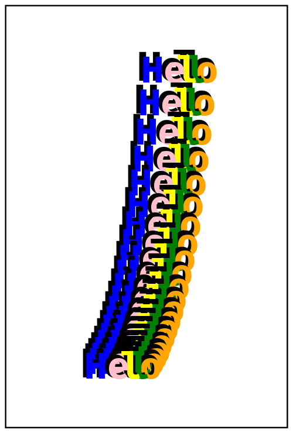
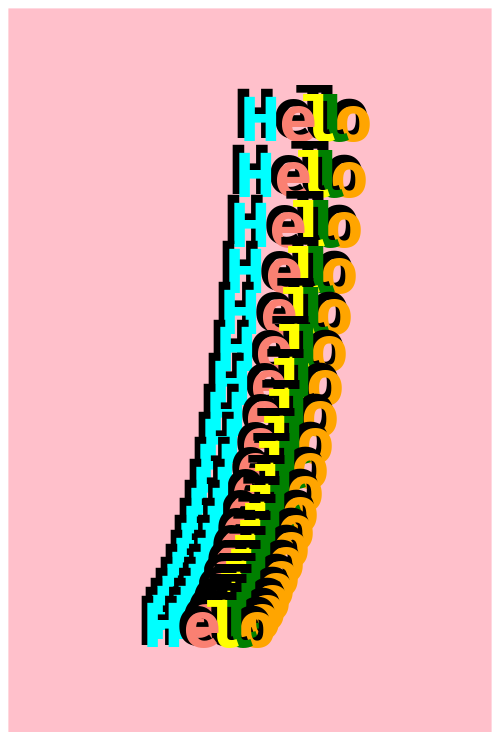

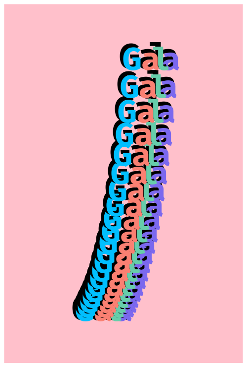

#### [Tiled-Room](Tiled-Room)

#### [Tilings-95](Tilings-95)

#### [Vector-Field](Vector-Field)

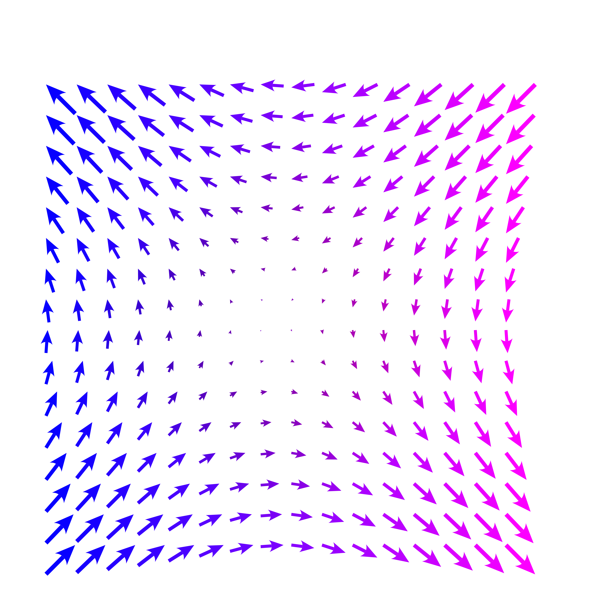

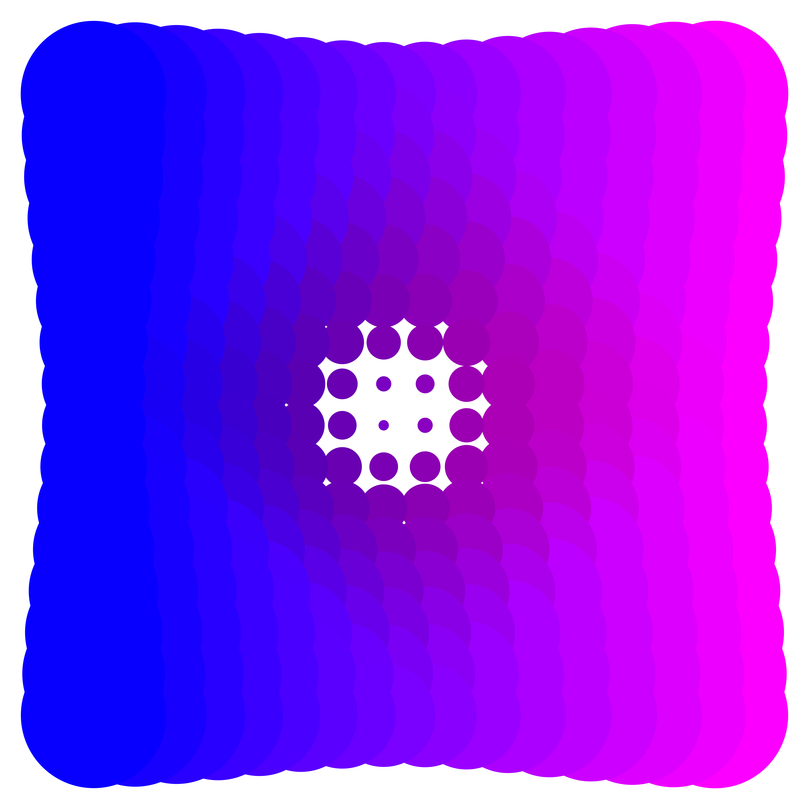
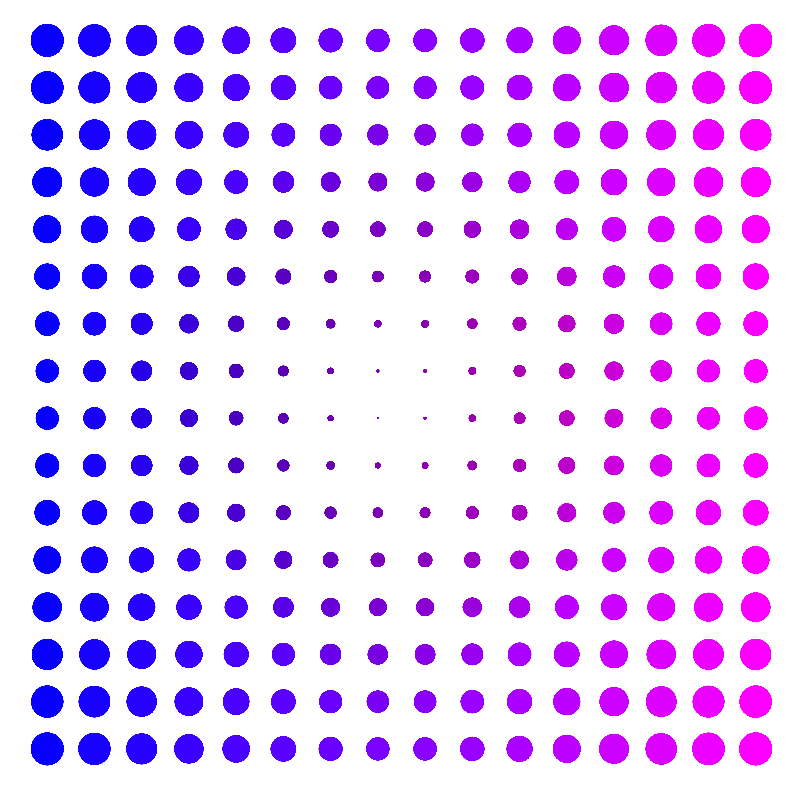
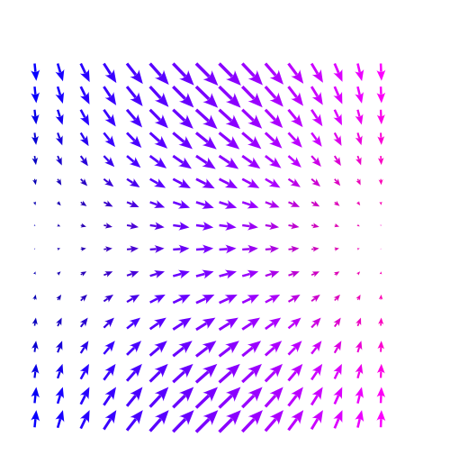

#### [Warp-Speed](Warp-Speed)

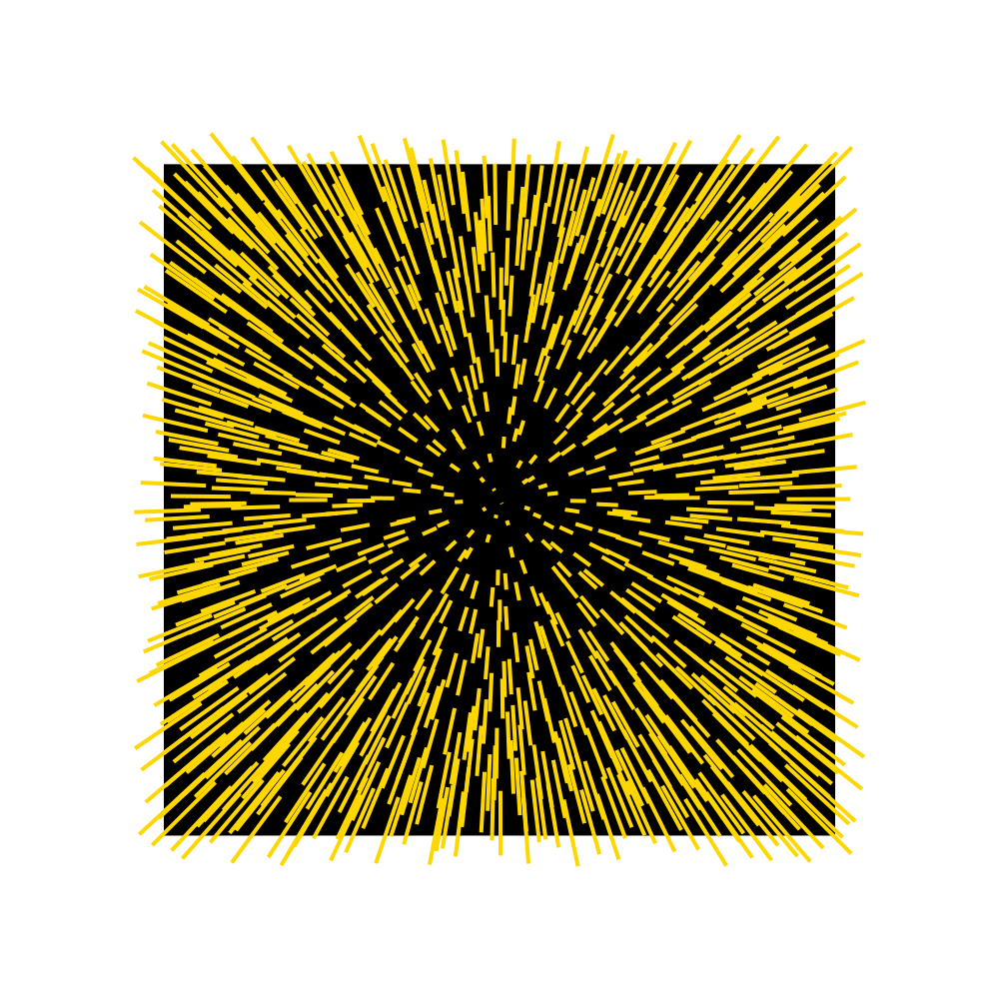

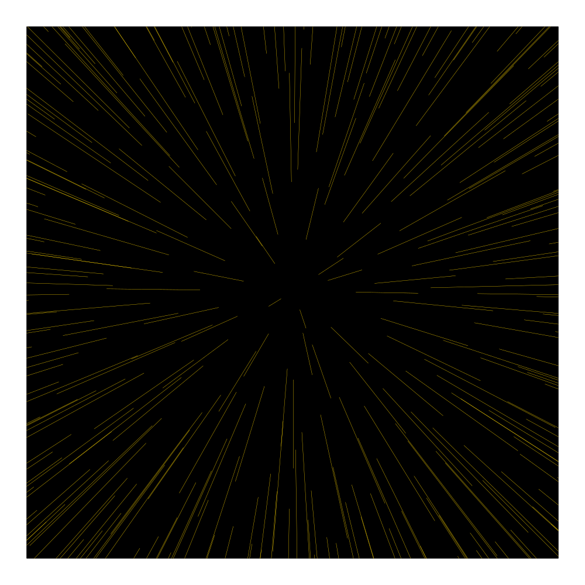
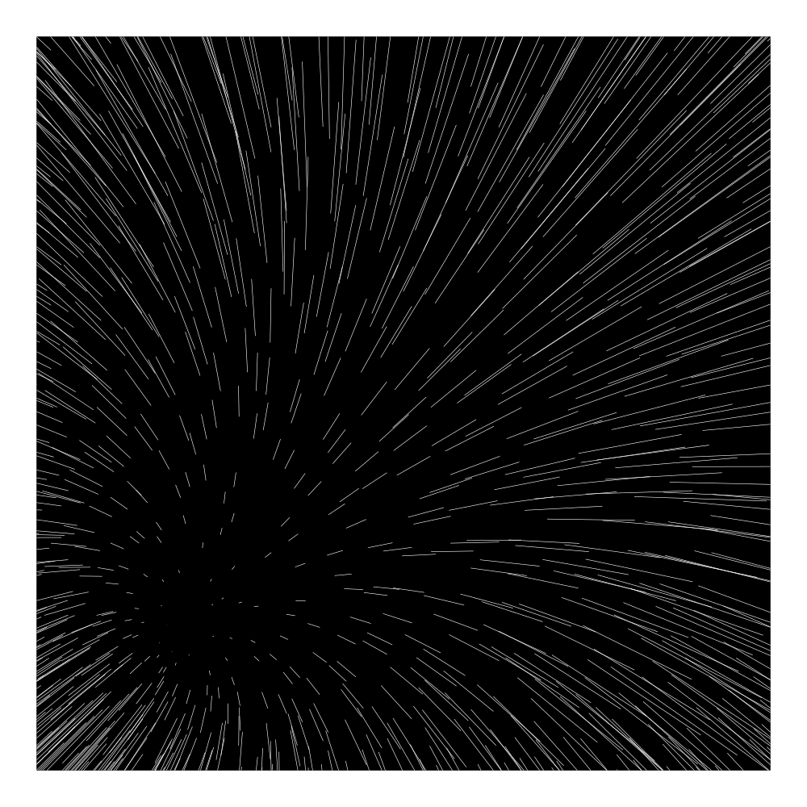
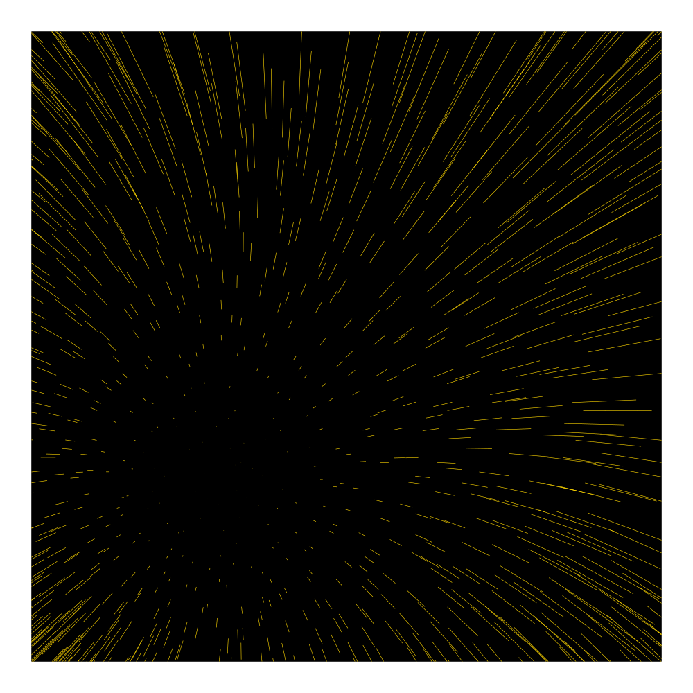
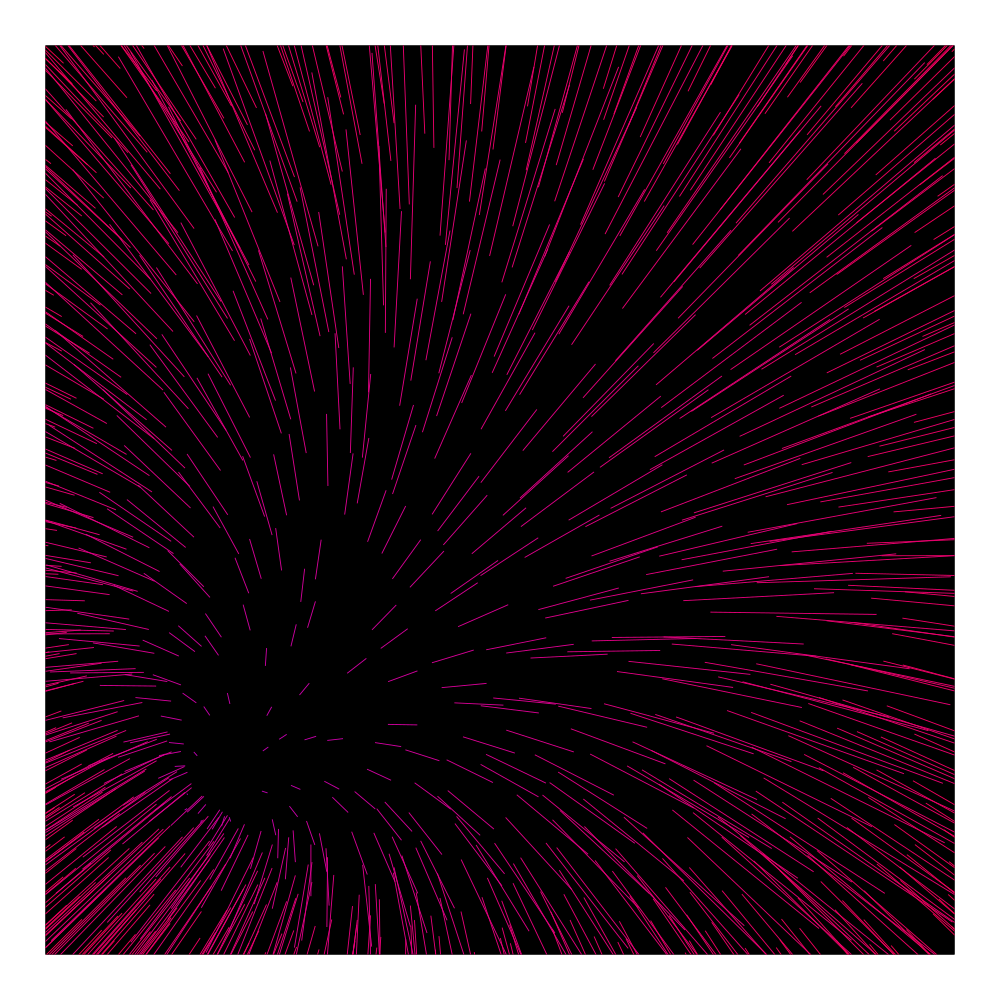

#### [Wavey-Paper](Wavey-Paper)

